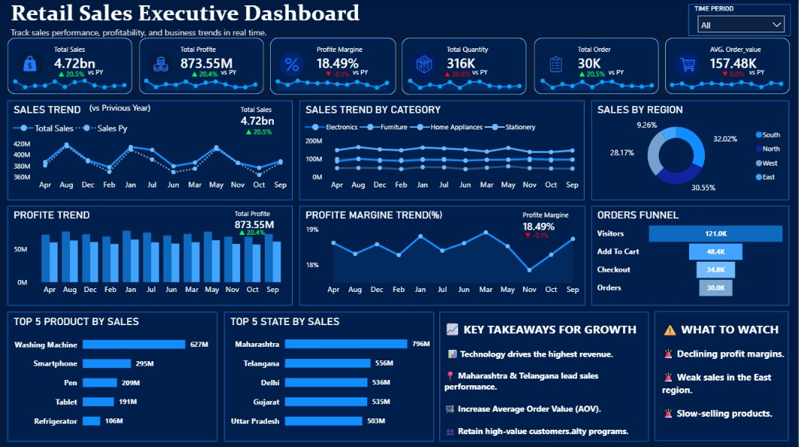

# 📊 Retail Sales Performance & Executive Analytics Dashboard

> A Business Intelligence solution that transforms retail sales data into actionable insights, enabling executives and business managers to make faster, data-driven decisions through interactive analytics.


---

# 📌 Executive Summary

Modern businesses generate large volumes of sales data, but manual reporting often delays decision-making and limits visibility into overall business performance.

This project delivers an interactive Executive Analytics Dashboard that centralizes sales, profitability, customer, and regional performance into a single view, enabling leadership to monitor KPIs, identify growth opportunities, and make informed business decisions.

---

# 🚨 Business Problem

Traditional reporting creates several business challenges:

- Reports require significant manual effort to prepare.
- Sales information is distributed across multiple Excel files.
- Leadership lacks a single source of truth.
- Regional performance comparisons are difficult.
- Product profitability is not easily visible.
- Decision-making depends on static reports instead of interactive analytics.

These limitations reduce operational efficiency and delay strategic decisions.

---

# 🎯 Business Objectives

The dashboard was designed to:

- Centralize business reporting into a single interactive dashboard.
- Reduce manual reporting effort.
- Improve executive visibility into business performance.
- Monitor KPIs in near real time.
- Compare Year-over-Year business performance.
- Identify top-performing products and regions.
- Support strategic planning using data-driven insights.

---

# 📈 Estimated Business Impact

| Business Area | Before Dashboard | After Dashboard | Estimated Improvement |
|---------------|-----------------:|----------------:|----------------------:|
| Report Preparation Time | 3–4 Days | < 1 Hour | **85–90% Faster** |
| KPI Monitoring | Manual | Interactive Dashboard | **100% Visibility** |
| Data Consolidation | Multiple Excel Files | Single Dashboard | **100% Centralized** |
| YoY Analysis | Manual | Automated | **100% Automated** |
| Decision-Making Speed | Slow | Interactive Insights | **60–70% Faster** |
| Data Exploration | Limited | Drill-down Analysis | **70–80% More Efficient** |
| Business Monitoring | Periodic | Continuous KPI Tracking | **80% Better Visibility** |
| Operational Productivity | Manual Processes | Automated Analytics | **50–60% Improvement** |

> **Note:** These values represent expected operational improvements from replacing manual reporting with an interactive Business Intelligence dashboard.

---

# 🚀 Business Growth Opportunities

The dashboard enables management to:

- Increase revenue by identifying high-performing products and regions.
- Improve profitability through margin analysis.
- Detect declining sales before they become critical.
- Optimize inventory planning using sales trends.
- Improve customer targeting through segmentation analysis.
- Allocate marketing budgets more effectively.
- Compare regional performance to identify growth opportunities.
- Monitor business performance continuously instead of relying on periodic reports.

---

# 💼 Executive Value

This dashboard provides leadership with the ability to:

- Monitor company performance from one centralized dashboard.
- Track business KPIs instantly.
- Compare regional performance.
- Evaluate product profitability.
- Analyze customer purchasing behavior.
- Measure Year-over-Year growth.
- Identify business risks early.
- Support strategic decision-making with interactive analytics.

---

# 📊 Key Performance Indicators (KPIs)

- 💰 Total Sales
- 💵 Total Profit
- 📦 Total Orders
- 📊 Total Quantity Sold
- 📉 Profit Margin
- 🛒 Average Order Value (AOV)
- 📈 Sales Growth %
- 💹 Profit Growth %
- 🌍 Regional Revenue
- 👥 Customer Performance
- 🔄 Sales Funnel Metrics

---

# ❓ Business Questions Answered

This dashboard helps answer critical business questions:

- Which region generates the highest revenue?
- Which products contribute the highest profit?
- Which customer segment drives maximum sales?
- Which products are underperforming?
- How has business performance changed compared to last year?
- Which months generate the highest revenue?
- What is the Average Order Value?
- Which regions require management attention?
- Where are the biggest growth opportunities?
- Which categories have the highest profit margins?

---

# 📊 Dashboard Features

### Executive Dashboard

- Company-wide KPI monitoring
- Revenue & Profit overview
- YoY Growth Analysis
- Interactive filtering

### Sales Analysis

- Monthly Sales Trends
- Category Performance
- Product Performance
- Revenue Distribution

### Regional Analysis

- Regional Revenue Comparison
- Profit by Region
- Growth Analysis

### Customer Analysis

- Customer Segmentation
- Purchasing Trends
- Revenue Contribution

### Sales Funnel

- Visitors
- Add To Cart
- Checkout
- Orders

---

# 🖼 Dashboard Preview

## Executive Dashboard

The dashboard provides executives and business managers with a centralized view of sales performance, profitability, customer insights, regional trends, and key business KPIs.


---

# 📂 Repository Structure

```text
Retail-Sales-Performance-Dashboard/
│
├── Dashboard/
│   └── Retail Sales Executive Dashboard.pbix
│
├── Dataset/
│   └── Sales_Data.xlsx
│
├── Images/
│   ├── Dashboard Overview.png
│   ├── KPI Cards.png
│   ├── Sales Trend.png
│   ├── Regional Analysis.png
│   ├── Product Analysis.png
│   └── Sales Funnel.png
│
├── DAX/
│   ├── KPI Measures.md
│   ├── Previous Year Measures.md
│   ├── Growth Measures.md
│   ├── Display Measures.md
│   ├── Funnel Measures.md
│   └── Calendar Measures.md
│
└── README.md
```

---

# 📈 Expected Business Results

| Business Objective | Expected Improvement |
|--------------------|---------------------:|
| Reporting Efficiency | **90%** |
| KPI Accessibility | **100%** |
| Business Visibility | **80%** |
| Decision-Making Speed | **70%** |
| Data Exploration | **75%** |
| Operational Productivity | **60%** |
| Strategic Planning Efficiency | **50%** |

---

# 💡 Skills Demonstrated

### Business Skills

- Business Intelligence
- Business Analysis
- KPI Design
- Executive Reporting
- Performance Analysis
- Sales Analytics
- Strategic Decision Support

### Technical Skills

- Microsoft Power BI
- Power Query
- DAX
- Data Modeling
- Data Visualization
- Microsoft Excel
- GitHub

---

# 📄 Dataset Information

| Attribute | Details |
|-----------|---------|
| Source | Kaggle |
| Dataset Type | Retail Sales |
| Format | Excel (.xlsx) |
| Analysis Period | 2019–2024 |
| Purpose | Business Intelligence & Dashboard Development |

---

---

# 🤝 Feedback & Contributions

Constructive feedback and contributions are always welcome.

If you have ideas to enhance the dashboard or documentation, you can:

- Share suggestions for new business insights.
- Recommend additional KPIs or visualizations.
- Report issues or documentation improvements.
- Open an Issue or submit a Pull Request.

Your feedback helps make this project more valuable for the Business Intelligence community.


---
### Connect With Me

* **GitHub:** https://github.com/neerajsahu-git
* **LinkedIn:** https://www.linkedin.com/in/neerajkumarsahu-data

